# Be Part of the Team: Defining and Modelling Covert Agents in Multi-Agent Systems


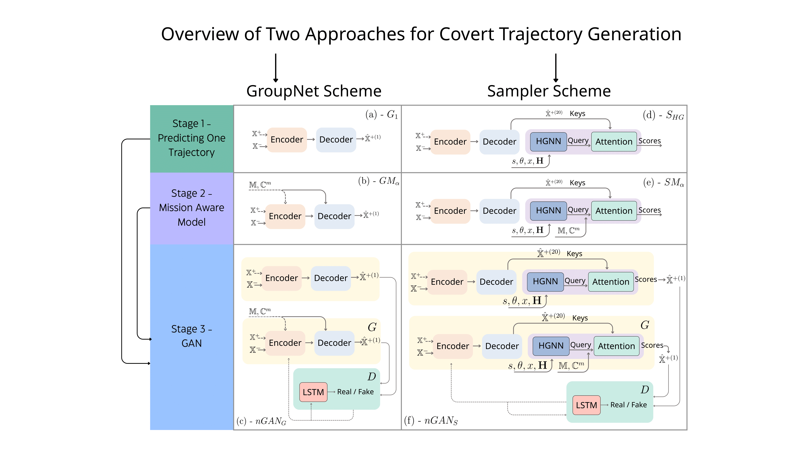 *Overview of the two architectures examined for researching covertness. Structured in three stages. The left-hand side depicts the GroupNet scheme: Panel (a) shows the base model $G_1$, panel (b) integrates mission embedding into $G_1$, resulting in $GM_\alpha$, and panel (c) shows the adversarial model trained for covertness, $nGAN_G$. The right-hand side illustrates the Sampler scheme with the same three stages: Panel (d) shows $S_{HG}$, panel (e) shows $SM_\alpha$, and panel (f) presents $nGAN_S$. The Encoder-Decoder blocks correspond to the original CVAE architecture of [GroupNet](https://arxiv.org/abs/2204.08770) . Also code was based on GroupNet's.* 

**Abstract**: In this work, we introduce the unexplored concept of covertness: the ability of artificial
covert agents ($C$) to behave indistinguishably from realistic collectives ($S$) while pursuing distinct goals, such
as navigating to a specific location, balancing the trade-off between detectability} and mission performance. To evaluate this,
we propose quantitative metrics. These metrics assess whether $C$ agents remain undetected by an external observer and
exhibit low errors in group-level pattern distribution compared to the expected collective movement, all while achieving
better mission performance, as indicated by a higher mission success rate than that of $S$ agents. Our approach addresses
limitations in standard short-term trajectory prediction benchmarks, which often overlook long-term group-level dynamics.
While initially motivated by the goal of embedding covert robotic agents into animal groups to support conservation efforts
(e.g. leading animals away from danger), similar challenges of subtle integration arise in other real-world scenarios, such
as match-fixing detection in sports and security applications. 

To address these challenges, we introduce a three-stage framework. First, we develop close-to-realistic simulators, modelling
the dynamics of collectives using predictive models, further enhanced with a sampling approach to improve accuracy. The
second stage extends these models to create mission-aware agents ($C$), which demonstrate higher goal achievement;
however, their appearance often deviates from the expected distribution. In the third stage, we refine $C$s' behaviour
using a Generative Adversarial Network (GAN), which trains them to remain undetected within the $S$ collective. 

Evaluations were conducted across fish, NBA players, and pedestrian datasets. In all datasets, within the GAN framework,
the observer failed to detect 20\%-40\% of covert agents, compared to 0\% for baselines. Moreover, the observer's average
covert agents classification score resulted in random guessing between $C$ and $S$. However, only among NBA players did covert
agents retain flexibility, achieving near-zero errors in long-term appearance metrics when no mission was introduced,
effectively functioning as passive agents. Additionally, mission performance improved by up to 181\% relative to $S$. 

This work lays the first cornerstones for the research on covertness and demonstrates promising results: we successfully
created covert, mission-driven agents that achieve higher mission performance while blending into group dynamics.


## Requirement

### Environment

* Tested OS: Linux (Ubuntu-based) / RTX A6000 and A40
* Python == 3.10.12
* PyTorch == 2.5.1+cu12.1.1

### Dependencies

Install the dependencies from the `requirements.txt`:
```linux
pip install -r requirements.txt
```

## Data preparation
Each dataset has its own preprocessing file, look in `datasets/<NAME>` to start preprocessing. 
Note that for this research only the datasets: SDD, NBA and Fish were utilized. The preprocessed files already set, howerver, for self-configuration you can: 


  * Download the NBA trajectories from 
     ['NBA-Player-Movements'](https://github.com/linouk23/NBA-Player-Movements/tree/master/data/2016.NBA.Raw.SportVU.Game.Logs) and put them in [`datasets/nba/source`](datasets/nba/source). Then run:
     ```
     python generate_dataset.py
     ```

  * Download the FISH trajectories from 
    ['Guppy-Fish'](https://edmond.mpg.de/dataset.xhtml?persistentId=doi:10.17617/3.4Y), track with [TRex](https://elifesciences.org/articles/64000#bib75), normalize them between 0-100, and put them in [`datasets/fish/source`](datasets/fish/source). Then run:
    ```
    python preprocess_fish.py
    ```

  * Download the SDD trajectories from 
    ['Stanford-Dron-Dataset'](https://www.kaggle.com/datasets/aryashah2k/stanford-drone-dataset) and put them in [`datasets/SDD/raw`](datasets/SDD/raw), by scenes. Then run:
    ```
    python prepare_SDD_data.py
    ```

## Visualizations 
Shown under every model: NBA, Fish, SDD, from left to right. If exist, X's are missions, and agents with black border are mission aware.

## Training & Testing
All defaults are set to the NBA dataset and the project's hyperparameters, pre-trained models were also provided. For $G1$ and $GM$ modules, the configuration are within the modules, for the rest are in the `config.py` file. 

For NBA, the training file is "train_1"; for Fish "train1_train3"; for SDD "train".
The testing file for all datasets named as: "test".
When training the sdd dataset, add `--test_prior`. When testing it, add `--test_prioir` and the sdd scene being tested (in our case 2): `--sdd_scene 2`.


## Base Model - GroupNet - $G_1$
To train a GroupNet model, simply run:
```
python G1/train_hyper.py --dataset <Dataset Name> --training_type <Dataset Based> 
```

Trained models will be saved in `G1/<Dataset Name>/saved_models`

To evaluate the model performance, run:

```
python G1/test_hyper.py --model_names <G1 model> --sample_k
```
Note that `sample_k` is set for 1 prediction; however evaluation for short-term metrics will be on $minG_{20}$, $GR_{20}$, $Baseline$. The long term will be for $G1$. For evaluating long-term metrics on $Baseline$ add: `--test_random_baseline baseline` and for $GR_{20}$: `--test_random_baseline random`.

Tests and figures will be saved in `G1/stats/<Dataset Name>` 

<p align="center">
  
  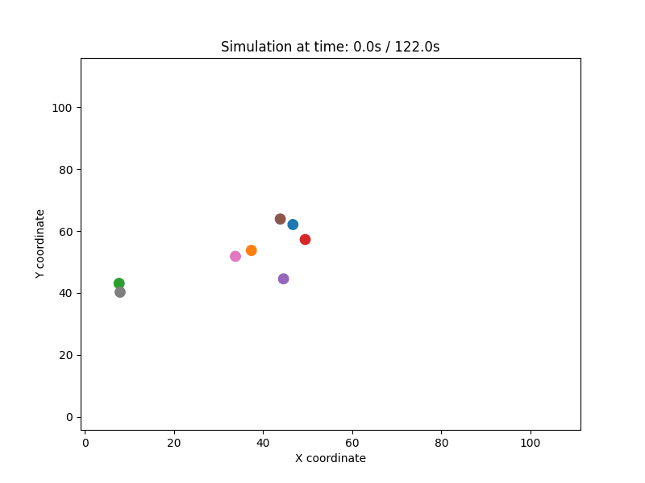
  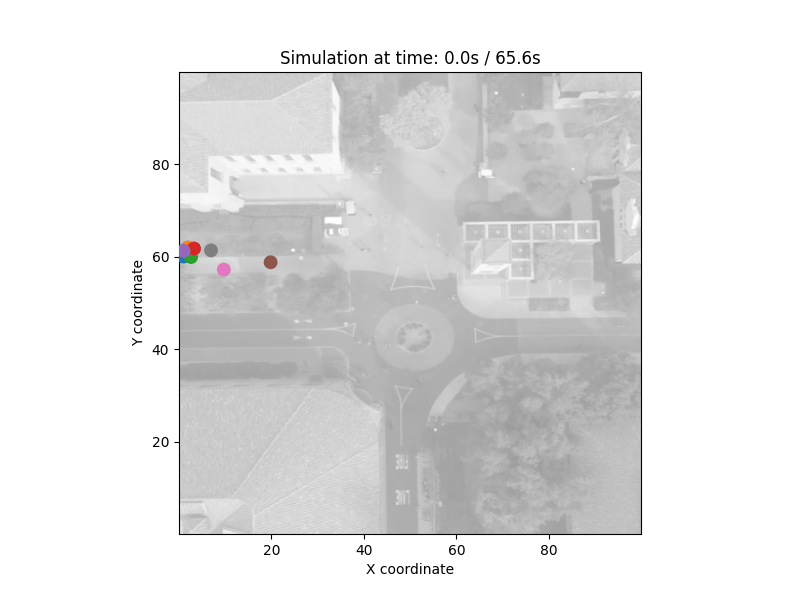
</p>

## Base Model - Sampler - $S_{HG}$ and $S_{MLP}$

To train a Sampling model, run:
```
python Sampler/main_sampler.py --model_names <G1 model> --dataset <Dataset Name> --training_type <Dataset Based> --mode train 
```
Be careful when choosing the right pre-trained $G1$ model using `--model_names`. If you wish to train MLP based sampler add `--test_mlp`.
Trained models will be saved in `Sampler/<Dataset Name>/saved_models`. 

To evaluate the model performance, run:

```
python Sampler/main_sampler.py --model_names <G1 model> --saved_models_SAM <the sampler model> --mode test --batch_size 1
```

Tests and figures will be saved in `Sampler/stats/<Dataset Name>` 

### $S_{HG}$
<p align="center">
  
  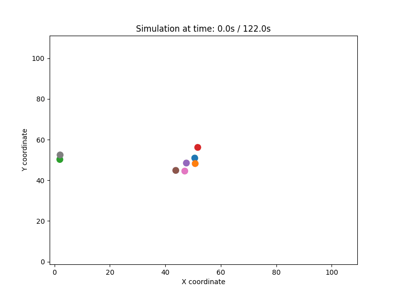
  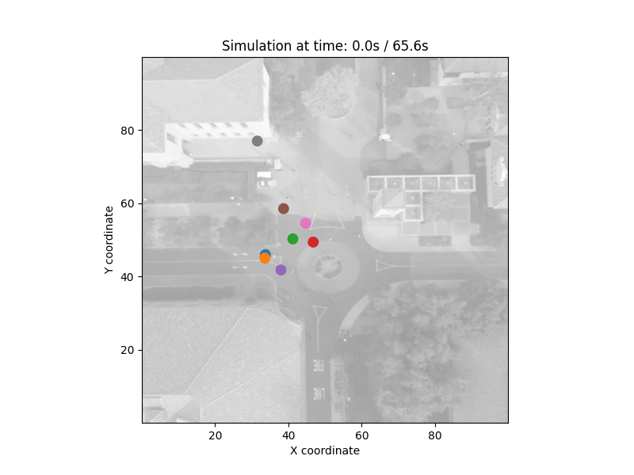
</p>

### $S_{MLP}$
<p align="center">
  
  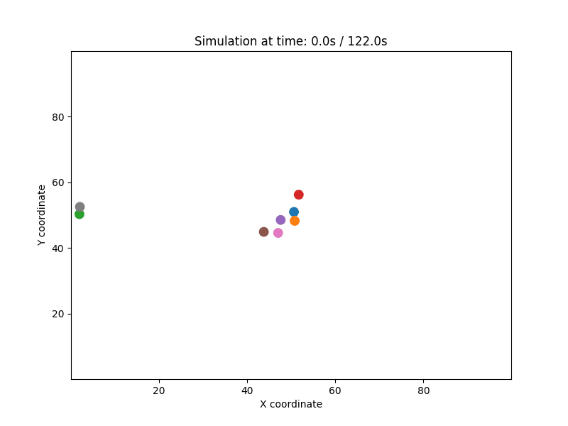
  
</p>

## Mission Aware Model - $GM$
For training run:
```
python GM/train_hyper_mission.py --dataset <Dataset Name> --training_type <Dataset Based>  --how_far 0.2 
```
Add `how_far`, which is controlling the $\alpha$ value: how sensitive agents will be to their predefined goals.

Trained models will be saved in `GM/<Dataset Name>/saved_models`

To evaluate the model performance, run:

```
python GM/test_hyper_mission.py --model_names <GM model>
```

Tests and figures will be saved in `GM/stats/<Dataset Name>` 

### NBA - $GM_{0.2}$; Fish - $GM_{0.2}$; SDD - $GM_5$

<p align="center">
  
  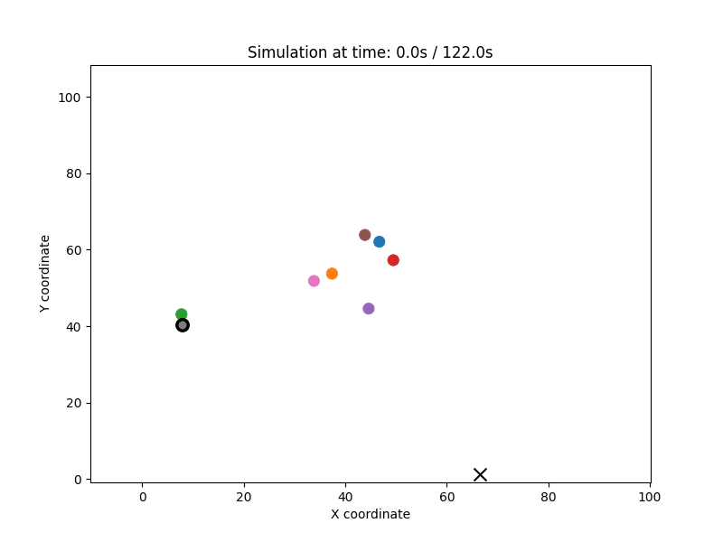
  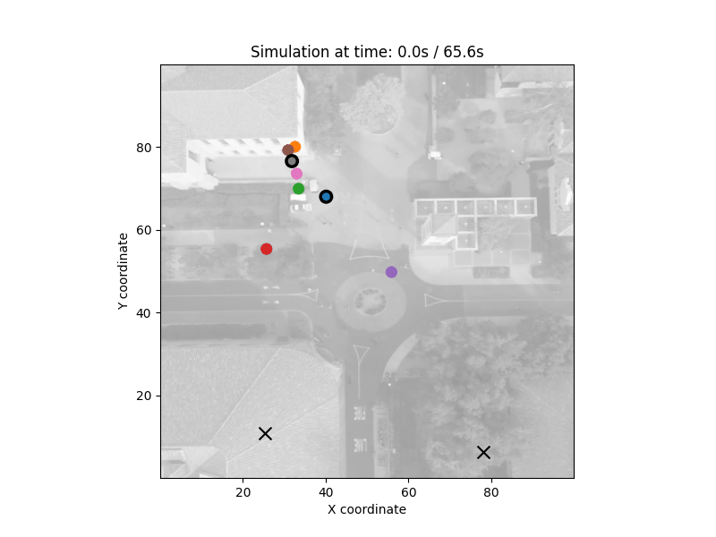
</p>

### NBA - $GM_{1}$; Fish - $GM_{1}$; SDD - $GM_2$

<p align="center">
  
  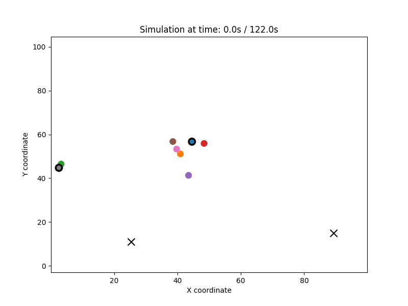
  
</p>

## Mission Aware Model - $SM$

For training run:
```
python SM/main_sampler_mission.py --dataset <Dataset Name> --training_type <Dataset Based> --model_names <G1 model> --mode train --how_far 0.2 
```
Add `how_far`, which is controlling the $\alpha$ value: how sensitive agents will be to their predefined goals.

Trained models will be saved in `SM/<Dataset Name>/saved_models`

To evaluate the model performance, run:

```
python SM/main_sampler_mission.py --model_names <G1 model> --saved_models_SAM <the mission sampler model> --mode test --batch_size 1
```

Tests and figures will be saved in `SM/stats/<Dataset Name>` 


### NBA - $SM_{0.2}$; Fish - $SM_{0.2}$; SDD - $SM_5$

<p align="center">
  
  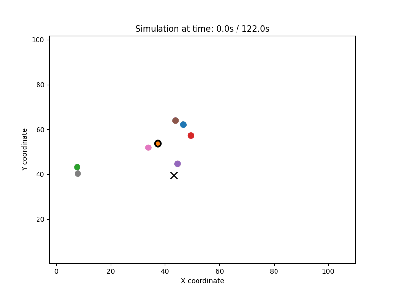
  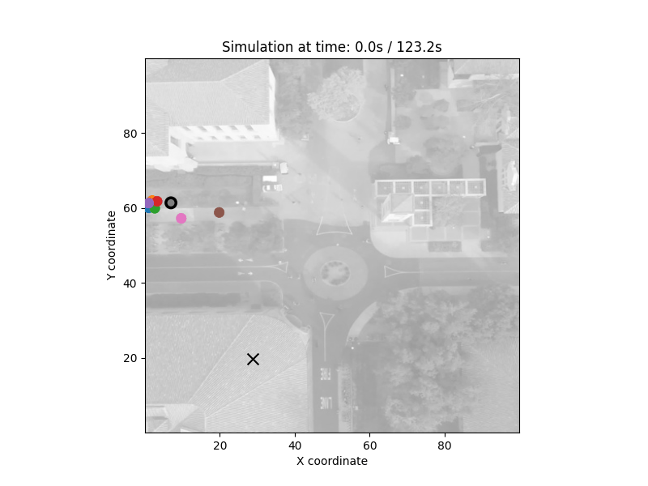
</p>

### NBA - $SM_{1}$; Fish - $SM_{1}$; SDD - $SM_2$

<p align="center">
  
  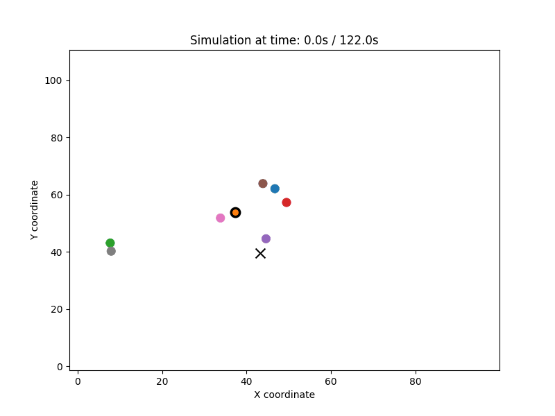
  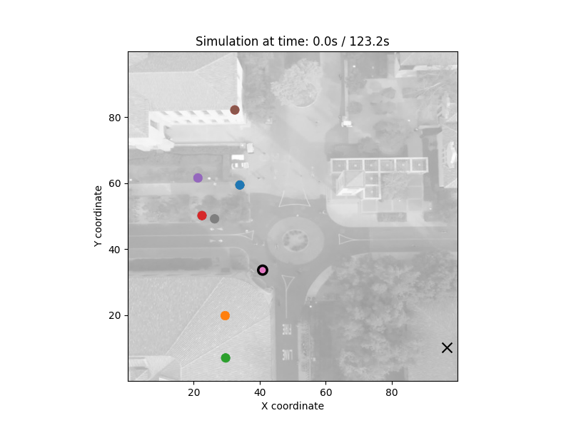
</p>


## Pretraining the Discriminator
For training groupnet's scheme discriminator run:
```
python Classifier/main_classifier_groupnet.py --dataset <Dataset Name> --model_names <G1 model> --training_type <Dataset Based>  --mode train --saved_models_GM <GM model> 
```

For training sampler's scheme discriminator run:
```
python Classifier/main_classifier_sampler.py --dataset <Dataset Name> --model_names <G1 model> --training_type <Dataset Based>  --mode train --saved_models_SM <mission aware sampler model> --saved_models_SAM <basic sampler model> 
```

Trained models will be saved in `Classifier/<Dataset Name>/saved_models`


## $GAN_G$ 

For training, run:
```
python GANG/main_GAN_groupnet_mission.py --model_names <G1 model> --dataset <Dataset Name> --training_type <Dataset Based> --mode train --saved_models_GM <pretrained GM> --saved_models_DIS <pretrained classifier>
```
Trained models will be saved in `GANG/<Dataset Name>/saved_models`. 

To evaluate the model performance, run:

```
python GANG/main_GAN_groupnet_mission.py --model_names <G1 model> --saved_models_GAN_GM <the GAN's geenrator> --saved_models_GAN_DIS <the GAN's discriminator> --mode test --batch_size 1
```
Tests and figures will be saved in `GANG/stats/<Dataset Name>` 

To run the uninformed discriminator, first train it on the chosen GAN's epoch (since the previous trained models are now being evaluated - we are going to split the test to second train-test for the discriminator):
```
python GANG/testing_GAN_groupnet.py --mode train --training_type test --dataset <> --model_names <G1 model> --saved_models_GAN_GM <the GAN's generator> --saved_models_GAN_DIS <the GAN's discriminator>
```

Then, test it on its chosen discriminator's epoch:
```
python GANG/testing_GAN_groupnet.py --mode test --training_type test --dataset <> --model_names <G1 model> --saved_models_GAN_GM <the GAN's generator> --saved_models_GAN_DIS <the GAN's discriminator> --saved_models_non_trained_DIS <the trained model>
```

For both training and testing, `disc_type` can be set to either `groupnet-gan` (default), `baseline` (Base_rigid), `smooth` (Base_smooth)


### $250GAN_G$

<p align="center">
  
  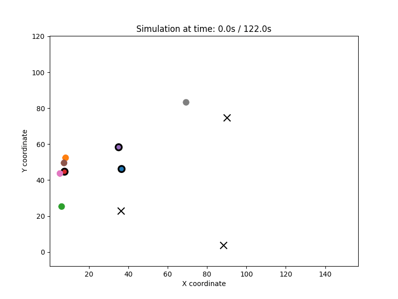
  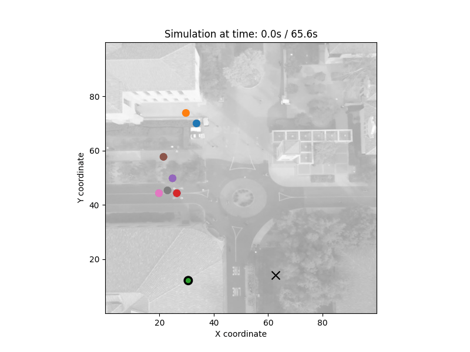
</p>

## $GAN_S$


For training, run:
```
python GANS/main_GAN_sampler_mission.py --model_names <G1 model> --dataset <Dataset Name> --training_type <Dataset Based> --mode train --saved_models_SM <pretrained SM> --saved_models_DIS <pretrained classifier> --saved_models_SAM <pre-trained regular sampler>
```
Trained models will be saved in `GANS/<Dataset Name>/saved_models`. 

To evaluate the model performance, run:

```
python GANG/main_GAN_sampler_mission.py --model_names <G1 model> --saved_models_GAN_SM <the GAN's geenrator> --saved_models_GAN_DIS_SM <the GAN's discriminator> --mode test --batch_size 1 --saved_models_SAM <pre-trained regular sampler>
```
Tests and figures will be saved in `GANS/stats/<Dataset Name>` 

To run the uninformed discriminator, first train it on the chosen GAN's epoch (since the previous trained models are now being evaluated - we are going to split the test to second train-test for the discriminator):
```
python GANS/testing_GAN_sampler.py --disc_type sampler-gan --mode train --training_type test --dataset <> --model_names <G1 model> --saved_models_GAN_SM <the GAN's generator> --saved_models_GAN_DIS_SM <the GAN's discriminator> --saved_models_SAM <pre-trained regular sampler>
```

Then, test it on its chosen discriminator's epoch:
```
python GANG/testing_GAN_sampler.py --disc_type sampler-gan --mode test --training_type test --dataset <> --model_names <G1 model> --saved_models_GAN_SM <the GAN's generator> --saved_models_GAN_DIS_SM <the GAN's discriminator> --saved_models_non_trained_DIS_SM <the trained model> --saved_models_SAM <pre-trained regular sampler>
```

For both training and testing, `disc_type` can be set to either `sampler-gan`, `baseline` (Base_rigid), `smooth` (Base_smooth)

### $250GAN_S$

<p align="center">
  
  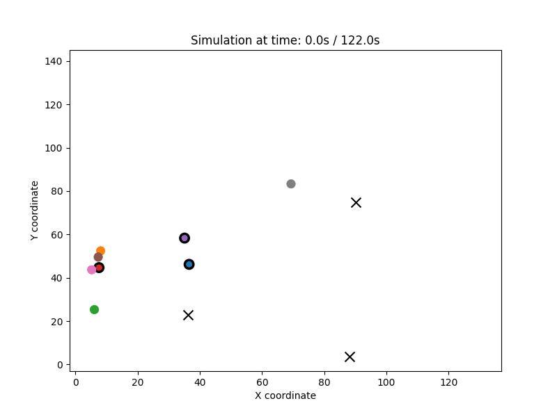
  
</p>

